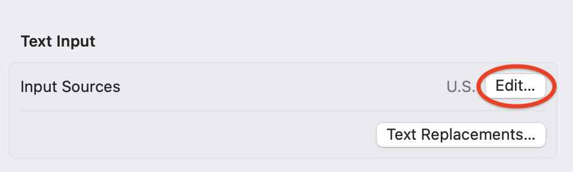
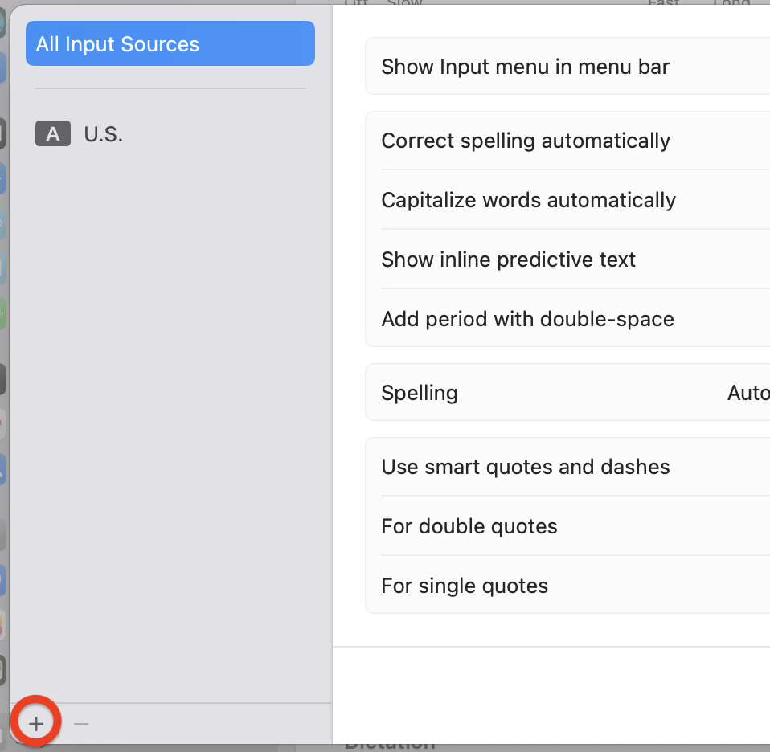
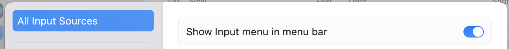
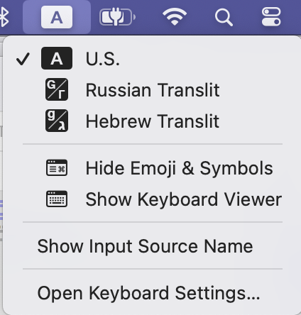
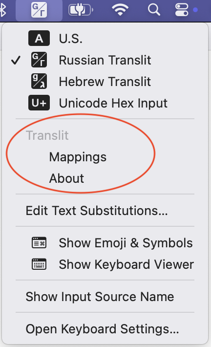

#  Translit


[](https://opensource.org/license/gpl-3-0/)
[](https://github.com/gershnik/Translit/actions/workflows/test.yml)

<!-- Links -->
[input_sources]:  https://support.apple.com/guide/mac-help/change-input-sources-settings-mchl84525d76/mac
[translit_ru]: https://translit.ru
[releases]: https://github.com/gershnik/Translit/releases
[cyrillic-transliterator]: https://github.com/archagon/cyrillic-transliterator

<!-- End Links -->

This macOS keyboard _[input source][input_sources]_ allows a user familiar only with Latin alphabet keyboard to 
type in other languages by using common Latin transliteration of the target language letters. 
Currently supported target languages are Hebrew and Russian. 
To give an example, typing `privet` in Russian mode will produce `привет` and typing `hi` in Hebrew mode will produce `הי`.


<!-- TOC depthfrom:2 -->

- [Features](#features)
- [Installation](#installation)
    - [Keyboard shortcuts](#keyboard-shortcuts)
    - [Viewing transliteration mappings](#viewing-transliteration-mappings)
    - [Uninstallation](#uninstallation)
- [Mappings](#mappings)
    - [Russian](#russian)
    - [Hebrew](#hebrew)
- [Building](#building)

<!-- /TOC -->

## Features

- Type normally in any window without copy/pasting from a separate app/browser
- Supports multiple languages: currently Russian and Hebrew with an easy way to add more if desired - just ask.
- Supports modern macOS versions
- Distributed as signed and notarized installer - you don't need to build it yourself (but you can if you want to).
- Reliable installation and uninstallation on recent versions of macOS.<br/> 
  Starting roughly with macOS Ventura, Apple has introduced various bugs into its keyboard input sources architecture 
  that make adding and removing them unreliable, error prone and require log off. The installer and uninstaller for this
  application makes the whole process reliable and simple for the user.
- Not using punctuation like `'` or `#` for transliteration.<br/>
  When typing normally on macOS (as opposed to some 
  designated transliteration app) switching between input modes is more complicated - you cannot just press `ESC` like
  [translit.ru][translit_ru] does. This makes typing text with lots of punctuation annoying. Additionally hijacking `'`
  interferes with macOS "smart quotes" if you use this feature. Avoiding punctuation, such  as using `q` for `ь` 
  and `qq` for `ъ` makes typing much smoother.

  There are existing macOS transliteration projects on Github such as [cyrillic-transliterator][cyrillic-transliterator] 
  and its forks but none of them supports all the features above.

## Installation
  
* Navigate to [Releases][releases] page and download `Translit-x.y.pkg` package installer. 
* Run it and install the app
* You will be prompted to log off at the end of the installation. This is unfortunately necessary. Apple provides
  no way to avoid this.
* After you log back in launch `System Preferences ⇒ Keyboard`
* In the `Text Input` section press `Edit...` button for `Input Sources`<br/>
  
* Press the `+` button to add an input source<br/>
  
* Navigate to `Russian` or `Hebrew` language and select `Russian Translit` or `Hebrew Translit` as desired. If you wish 
  to use both press the `+` again after adding one.

You are all set. If you have enabled `Show Input menu in menu bar` setting



you should see something like this in it



Select the newly added input method and you can start typing in it anywhere.

### Keyboard shortcuts

By default macOS sets `⌃Space` and `⌃⌥Space` to switch between different input sources. Which is far more convenient when typing than using the menu bar.

If these aren't working navigate to `System Preferences ⇒ Keyboard ⇒ Keyboard Shortcuts ⇒ Input Sources` and enable or change them.

### Viewing transliteration mappings

When a transliteration input mode is selected the pop-up system menu will show addition entries like these



Select `Show Mappings` to display which Latin characters and combination map to which letters of the target language.


### Uninstallation

To completely uninstall Translit issue the following commands in Terminal

* If you installed Translit only for yourself

```bash
~/Library/Input\ Methods/Translit.app/Contents/MacOS/Translit --uninstall
```

* If you installed Translit for all users

```bash
/Library/Input\ Methods/Translit.app/Contents/MacOS/Translit --uninstall
```

You can also see the exact command for your installation in `About Translit` menu with a translit mode selected.

Just like with installation, you will be prompted for a logoff at the end. This, unfortunately, is also necessary due
to Apple's bugs. 

## Mappings

The character mappings for Russian and Hebrew are given in the following tables

### Russian

<table><tr>
<td>А</td><td>а</td><td>Б</td><td>б</td><td>В</td><td>в</td><td>Г</td><td>г</td>
<td>Д</td><td>д</td><td>Е</td><td>е</td><td>Ё</td><td>ё</td><td>Ж</td><td>ж</td>
</tr><tr>
<td>A</td><td>a</td><td>B</td><td>b</td><td>V</td><td>v</td><td>G</td><td>g</td>
<td>D</td><td>d</td><td>E</td><td>e</td><td>Jo<br>Yo<br>Ö<br>Ë</td><td>jo<br>yo<br>ö<br>ë</td><td>Zh</td><td>zh</td>
</tr></table>
<table><tr>
<td>З</td><td>з</td><td>И</td><td>и</td><td>Й</td><td>й</td><td>К</td><td>к</td>
<td>Л</td><td>л</td><td>М</td><td>м</td><td>Н</td><td>н</td><td>О</td><td>о</td>
</tr><tr>
<td>Z</td><td>z</td><td>I</td><td>i</td><td>J</td><td>j</td><td>K</td><td>k</td>
<td>L</td><td>l</td><td>M</td><td>m</td><td>N</td><td>n</td><td>O</td><td>o</td>
</tr></table>
<table><tr>
<td>П</td><td>п</td><td>Р</td><td>р</td><td>С</td><td>с</td><td>Т</td><td>т</td>
<td>У</td><td>у</td><td>Ф</td><td>ф</td><td>Х</td><td>х</td><td>Ц</td><td>ц</td>
</tr><tr>
<td>P</td><td>p</td><td>R</td><td>r</td><td>S</td><td>s</td><td>T</td><td>t</td>
<td>U</td><td>u</td><td>F</td><td>f</td><td>H<br>X</td><td>h<br>x</td><td>C</td><td>c</td>
</tr></table>

<table><tr>
<td>Ч</td><td>ч</td><td>Ш</td><td>ш</td><td>Щ</td><td>щ</td><td>Ъ</td><td>ъ</td><td>Ы</td><td>ы</td>
<td>Ь</td><td>ь</td><td>Э</td><td>э</td><td>Ю</td><td>ю</td><td>Я</td><td>я</td>
</tr><tr>
<td>Ch</td><td>ch</td><td>Sh</td><td>sh</td><td>W<br>Shh</td><td>w<br>shh</td><td>QQ</td><td>qq</td><td>Y</td><td>y</td>
<td>Q</td><td>q</td><td>Je<br>Ä</td><td>je<br>ä</td><td>Ju<br>Yu<br>Ü</td><td>ju<br>yu<br>ü</td><td>Ja<br>Ya</td><td>ja<br>ya</td>
</tr></table>

### Hebrew

<table dir="rtl"><tr>
<td>א</td><td>ב</td><td>ג</td><td>ד</td><td>ה</td><td>ו</td><td>ז</td><td>ח</td>
<td>ט</td><td>י</td><td>כ</td><td>ך</td><td>ל</td><td>מ</td><td>ם</td>
</tr><tr>
<td>a</td><td>b</td><td>g</td><td>d</td><td>h</td><td>o<br>u</td><td>z</td><td>x</td>
<td>T</td><td>i<br>j</td><td>k</td><td>K</td><td>l</td><td>m</td><td>M</td>
</tr></table>
<table dir="rtl"><tr>
<td>נ</td><td>ן</td><td>ס</td><td>ע</td><td>פ</td><td>ף</td>
<td>צ</td><td>ץ</td><td>ק</td><td>ר</td><td>ש</td><td>ת</td>
</tr><tr>
<td>n</td><td>N</td><td>s</td><td>y</td><td>f<br>p</td><td>F<br>P</td>
<td>c</td><td>C</td><td>q</td><td>r</td><td>w</td><td>t</td>
</tr></table>

## Building

Xcode 15 or above and Python 3 are the only requirements to build Translit.

* Download/clone the repo
* Run `fetch` script from the top-level directory (current directory doesn't matter). This will fetch external dependencies
* Open `Translit.workspace` and build the `Translit` or `Installer` scheme


