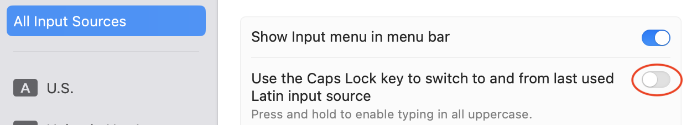
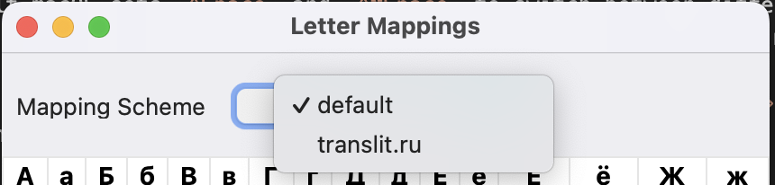

#  Translit


[](https://opensource.org/license/gpl-3-0/)
[](https://github.com/gershnik/Translit/actions/workflows/test.yml)

<!-- Links -->
[input_sources]:  https://support.apple.com/guide/mac-help/change-input-sources-settings-mchl84525d76/mac
[translit_ru]: https://translit.ru
[releases]: https://github.com/gershnik/Translit/releases
[cyrillic-transliterator]: https://github.com/archagon/cyrillic-transliterator
[wintranslit]: https://github.com/gershnik/TranslitForWindows

<!-- End Links -->

This macOS keyboard _[input source][input_sources]_ allows a user familiar only with a Latin alphabet keyboard to 
type in other languages by using common Latin transliteration of the target language letters. 
Currently supported target languages are Russian, Hebrew, Ukrainian and Belarusian. 
To give an example, typing `privet` in Russian mode will produce `привет` and typing `hi` in Hebrew mode will produce `הי`.

> [!NOTE]
> This software is for macOS only. A Windows version is available [here][wintranslit]


<hr>

<!-- TOC depthfrom:2-->

- [Features](#features)
- [Installation](#installation)
    - [Basics](#basics)
    - [Keyboard shortcuts](#keyboard-shortcuts)
    - [Viewing/Configuring transliteration mappings](#viewingconfiguring-transliteration-mappings)
    - [Uninstallation](#uninstallation)
- [Mappings](#mappings)
- [Building](#building)

<!-- /TOC -->

## Features

- Type normally in any window without copy/pasting from a separate app/browser
- Supports multiple languages: currently Russian, Hebrew, Ukrainian and Belarusian with an easy way to add more, if desired.
- Supports modern macOS versions
- Distributed as signed and notarized installer - you don't need to build it yourself (but you can, if you want to).
- Reliable installation and uninstallation on recent versions of macOS.<br/> 
  Starting roughly with macOS Ventura, Apple has introduced various bugs into its keyboard input sources architecture 
  that make adding and removing them unreliable, error prone and require log off. The installer and uninstaller for this
  application makes the whole process reliable and simple for the user.
- Having an option not to use punctuation like `'` or `#` for transliteration.<br/>
  When typing normally on macOS (as opposed to some 
  designated transliteration app) switching between input modes is more complicated - you cannot just press `ESC` like
  [translit.ru][translit_ru] does. This makes typing text with lots of punctuation annoying. Additionally hijacking `'`
  interferes with macOS "smart quotes" if you use this feature. Avoiding punctuation, such  as using `q` for `ь` 
  and `qq` for `ъ`, can make typing much smoother.
- Support for multiple transliteration schemes. Since many people would prefer to use familiar transliteration schemes
  from elsewhere, this application allows you to choose which scheme to use.
  Currently, in addition to the default, [translit.ru/translit.net][translit_ru] schemes are supported for Russian,
  Ukrainian and Belarusian. More can be added, if desired.

There are existing macOS transliteration projects on Github such as [cyrillic-transliterator][cyrillic-transliterator] 
and its forks but none of them supports all the features above.

## Installation

### Basics
  
* Navigate to [Releases][releases] page and download `Translit-x.y.pkg` package installer. 
* Run it and install the app
* You will be prompted to log off at the end of the installation. This is, unfortunately, necessary. Apple provides
  no way to avoid this.
* After you log back in launch `System Preferences ⇒ Keyboard`
* In the `Text Input` section, press the `Edit...` button for `Input Sources`<br/><br/>
  <br/>
* Press the `+` button to add an input source<br/><br/>
  <br/>
* Navigate to the desired target language (e.g. `Russian`, `Hebrew` etc.) and select `<Language> Translit` (for example `Hebrew Translit`).
  If you wish to add multiple languages press the `+` again after that.

You are all set. If you have enabled `Show Input menu in menu bar` setting


you should see something like this in it


Select the newly added input method and you can start typing in it anywhere.

### Keyboard shortcuts

On newer Macs, there is a dedicated 🌐 key that lets you switch between input sources.

In addition, on all Macs, by default macOS sets `⌃Space` and `⌃⌥Space` to switch between different 
input sources.

Either of these can be far more convenient than using the menu bar when typing mixed language text.

If shortcuts aren't working, navigate to `System Preferences ⇒ Keyboard ⇒ Keyboard Shortcuts ⇒ Input Sources` and enable or change them.

It is also possible to make the Caps Lock key switch between the default and Translit input sources. See
the following toggle in the `Input Sources` screen.<br/>

<br/>

### Viewing/Configuring transliteration mappings

When a transliteration input mode is selected, the pop-up system menu will show additional entries like these:


Select `Mappings` to display which Latin characters and combinations map to which letters of the target language.
If multiple transliteration schemes are supported for the target language you can also change the scheme.




### Uninstallation

To completely uninstall Translit issue the following commands in Terminal:

* If you installed Translit only for yourself

```bash
~/Library/Input\ Methods/Translit.app/Contents/MacOS/Translit --uninstall
```

* If you installed Translit for all users

```bash
/Library/Input\ Methods/Translit.app/Contents/MacOS/Translit --uninstall
```

You can also see the exact command for your installation in the `About` menu with a Translit mode selected.

Just like with installation, you will be prompted for a logoff at the end. This is, unfortunately, also necessary due
to Apple's bugs. 

## Mappings

Currently supported character mappings can be found in the following documents:

* 🇧🇾 [Belarusian](doc/mapping-be.md)
* 🇮🇱 [Hebrew](doc/mapping-he.md)
* 🇷🇺 [Russian](doc/mapping-ru.md)
* 🇺🇦 [Ukrainian](doc/mapping-uk.md)


## Building

Xcode 16.3 or above and Python 3.11 or above are the only requirements to build Translit.

* Download/clone the repo
* Run the `fetch` script from the top-level directory (current directory doesn't matter). This will fetch external dependencies
* Open `Translit.workspace` and build the `Translit` or `Installer` scheme


